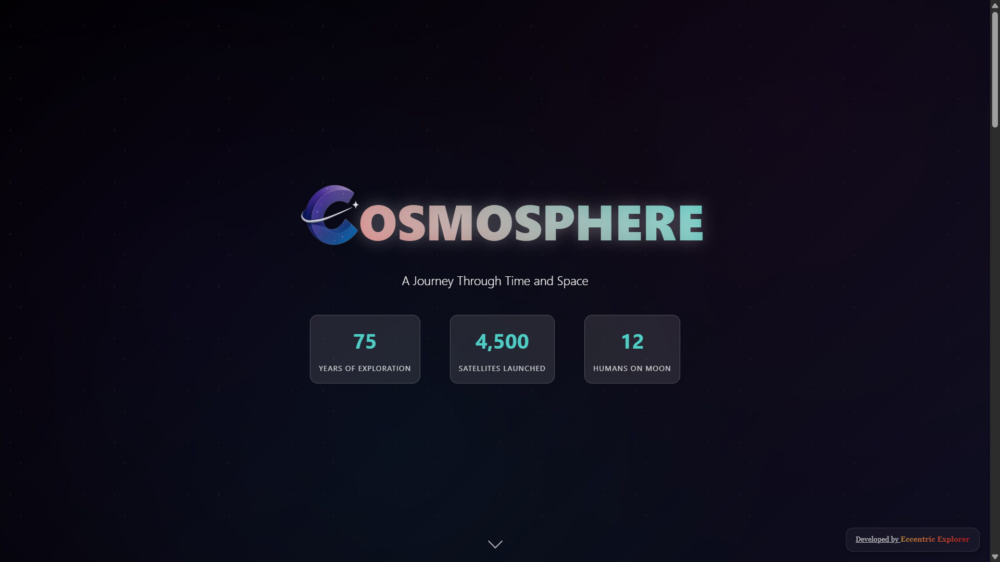

<div align="center"></div>

# <div align="center">COSMOSPHERE</div>

**Cosmosphere** is an interactive web-based infographic designed to visually present the evolution and future of space exploration. It features a dynamic timeline, insightful data visualisations, an interactive mission simulator, and a glimpse into future space endeavors, all within a visually engaging and informative environment.

---

## 🚀 Live Demo

Experience Cosmosphere live here: 
👉 [](https://eccentriccoder01.github.io/Cosmosphere)

 <div align="center">
 <p>

[](https://github.com/ellerbrock/open-source-badges/)


 </p>
 </div>

## 📸 Screenshots

<div align="center"></div>
<div align="center"></div>

---

### 💡 Core Features (Space Exploration & Data Presentation)

* **Animated Stars Background**: The website incorporates a captivating animated stars background that creates an immersive, celestial atmosphere, featuring radial gradients for a nebulous effect and twinkling stars that subtly animate across the screen.
* **Hero Section with Dynamic Counters**: The initial view presents a striking hero section with the title "Cosmosphere" and a descriptive subtitle. Animated counters increment to display key statistics like "Years of Exploration," "Satellites Launched," and "Humans on Moon."
* **Interactive Space Exploration Timeline**: This section provides a chronological overview of significant milestones in space exploration, categorized into "Early Era (1950s-1960s)," "Golden Age (1970s-1980s)," "Modern Era (1990s-2010s)," and "Future (2020s+)". Users can navigate between these eras, and each timeline item includes a year, title, description, and relevant statistics.
* **Data Visualisations**: Cosmosphere presents complex space exploration data through various interactive charts:
    * **Launch Success Rate (Progress Ring Chart)**: A circular progress chart visually represents the success rate of space missions.
    * **Countries in Space (Bar Chart)**: A bar chart illustrates the percentage contribution of different countries (USA, Russia, China, Others) to space exploration.
    * **Mission Types (Pie Chart)**: A pie chart breaks down space missions into categories such as Satellites, Planetary, Crewed, and Deep Space.
* **Interactive Space Mission Simulator**: Users can select a "Mission Type," adjust "Fuel Level" and "Crew Size," and the simulator dynamically calculates and displays "Success Probability," "Mission Cost," and "Duration". A "Launch Mission" button triggers an engaging rocket animation and presents a success or failure outcome.
* **The Future of Space Exploration**: This section highlights ambitious projects like "Mars Colonization," "Lunar Base," "Asteroid Mining," and "Interstellar Travel," each with a brief description and a progress bar. Clicking on these cards reveals more detailed information in a modal popup, including timelines and key challenges.
* **Tooltips for Enhanced Information**: Interactive tooltips appear on hover over certain elements, providing additional context.

### 🎨 User Interface & Experience

Cosmosphere provides a visually rich and responsive user interface:

* **Immersive Design**: The overall design is geared towards creating an immersive space-themed experience with celestial backgrounds and vibrant gradient accents.
* **Responsive Layout**: The application's layout adapts seamlessly to various screen sizes, ensuring optimal viewing and interaction on desktops, tablets, and mobile devices.
* **Intuitive Navigation**: Clear buttons and interactive elements guide the user through the timeline, data visualizations, and simulator.
* **Dynamic Animations**: Smooth transitions, counter animations, and visual feedback (like the rocket launch) enhance user engagement.
* **Clear Information Hierarchy**: Content is logically organized into distinct sections, making it easy for users to find information about different aspects of space exploration.

---

## 🛠️ Technology Stack

Cosmosphere is built using a standard web development stack, focusing on client-side technologies for a rich interactive experience.


---

## ⚙️ Setup Instructions

To run Cosmosphere:

### 1. Clone the Repository

```bash
git clone [https://github.com/eccentriccoder01/Cosmosphere.git](https://github.com/eccentriccoder01/Cosmosphere.git)
cd Cosmosphere
````

### 2\. Install Dependencies

Each folder (`js`, `styles`, `favicon`, etc.) is client-side. You can serve the project using any local server (e.g. `Live Server` in VSCode or Python's HTTP server):

```bash
npx live-server .
```
-----

## 🚧 Roadmap & Future Enhancements

  * [ ] Integrate more diverse historical data and future mission plans.
  * [ ] Add audio elements for an even more immersive experience.
  * [ ] Introduce user profiles to save simulator configurations or favorite timeline events.
  * [ ] Enhance data visualizations with more interactive elements and filtering options.
  * [ ] Develop more complex mission simulation scenarios.
  * [ ] Implement a search functionality for timeline events.

---

## Issue Creation ✴

Report bugs and issues or propose improvements through our GitHub repository's "Issues" tab.

## Contribution Guidelines 📑

- Firstly Star(⭐) the Repository
- Fork the Repository and create a new branch for any updates/changes/issue you are working on.
- Start Coding and do changes.
- Commit your changes
- Create a Pull Request which will be reviewed and suggestions would be added to improve it.
- Add Screenshots and updated website links to help us understand what changes is all about.

- Check the [CONTRIBUTING.md](CONTRIBUTING.md) for detailed steps...

## Contributing is fun🧡

We welcome all contributions and suggestions!
Whether it's a new feature, design improvement, or a bug fix - your voice matters 💜

Your insights are invaluable to us. Reach out to us team for any inquiries, feedback, or concerns.

## 📄 License

This project is open-source and available under the MIT License.

## 📞 Contact

Developed by [Eccentric Explorer](https://eccentriccoder01.github.io/Me)

Feel free to reach out with any questions or feedback\!